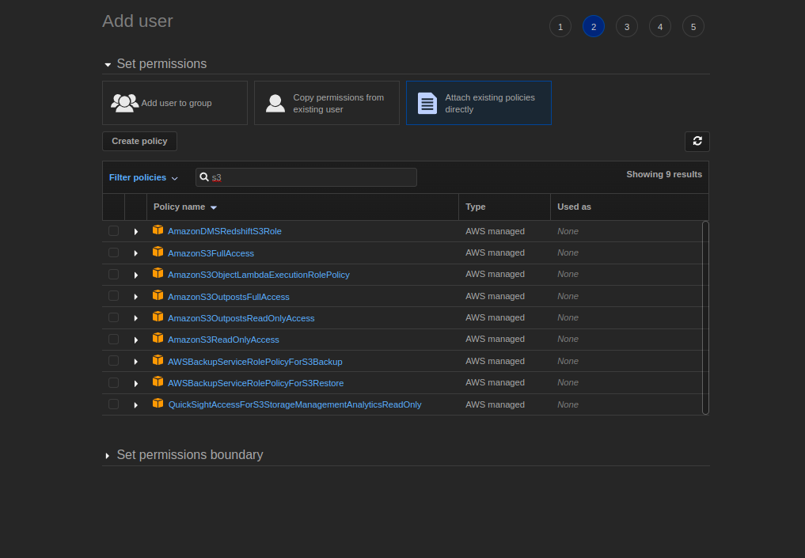

# S3

cf) IAM JSON 설정 레퍼런스  
- [IAM JSON policy elements reference](https://docs.aws.amazon.com/IAM/latest/UserGuide/reference_policies_elements.html)  
- [AWS JSON policy elements: Principal](https://docs.aws.amazon.com/IAM/latest/UserGuide/reference_policies_elements_principal.html)  

--- 

## AccessKey Base

Create S3 bucket

Create IAM user

- Credential type - Access Key 기반 설정하도록한다.

Set permission group or directly

- 편의를 위해 S3FullAccess 권한 반영.
- 자세한 권한 설정은 문서를 참조하여 반영하도록 한다.
- [Actions, resources, and condition keys for Amazon S3](https://docs.aws.amazon.com/AmazonS3/latest/userguide/list_amazons3.html)

### Gradle Setup

- Java AWS SDK
  - [Java AWS SDK](https://aws.amazon.com/ko/sdk-for-java/)  
  - [Java AWS SDK Gradle Setup](https://docs.aws.amazon.com/ko_kr/sdk-for-java/v1/developer-guide/setup-project-gradle.html)

- Spring Cloud AWS
  - [Spring Cloud AWS](https://spring.io/projects/spring-cloud-aws)
  - [Spring Cloud AWS Sample](https://github.com/spring-attic/aws-refapp)

### Implement

[[Refer] Spring Boot에서 AWS S3와 연계한 파일 업로드처리](https://antdev.tistory.com/93)

---
