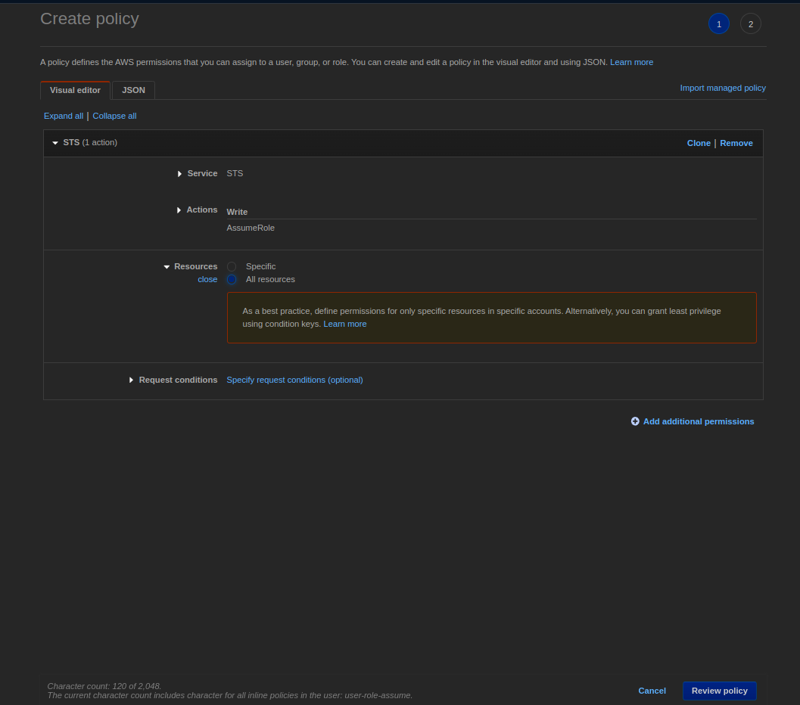

# S3

## AccessKey Base

Create S3 bucket


Create IAM user

- Credential type - Access Key 기반 설정하도록한다.


Set permission group or directly

- 편의를 위해 S3FullAccess 권한 반영.
- 자세한 권한 설정은 문서를 참조하여 반영하도록 한다.
  - [Actions, resources, and condition keys for Amazon S3](https://docs.aws.amazon.com/AmazonS3/latest/userguide/list_amazons3.html)

cf) IAM JSON 설정 레퍼런스
- [IAM JSON policy elements reference](https://docs.aws.amazon.com/IAM/latest/UserGuide/reference_policies_elements.html)
- [AWS JSON policy elements: Principal](https://docs.aws.amazon.com/IAM/latest/UserGuide/reference_policies_elements_principal.html)


### Gradle Setup

- Java AWS SDK
  - [Java AWS SDK](https://aws.amazon.com/ko/sdk-for-java/)  
  - [Java AWS SDK Gradle Setup](https://docs.aws.amazon.com/ko_kr/sdk-for-java/v1/developer-guide/setup-project-gradle.html)

- Spring Cloud AWS
  - [Spring Cloud AWS](https://spring.io/projects/spring-cloud-aws)
  - [Spring Cloud AWS Sample](https://github.com/spring-attic/aws-refapp)

### Implement

[[Refer] Spring Boot에서 AWS S3와 연계한 파일 업로드처리](https://antdev.tistory.com/93)  

[[Refer] Spring Cloud AWS를 활용하여 Spring Boot에서 AWS S3 연동하기](https://preamtree.tistory.com/83)

#### vault 반영

```bash
WARNING! dev mode is enabled! In this mode, Vault runs entirely in-memory
and starts unsealed with a single unseal key. The root token is already
authenticated to the CLI, so you can immediately begin using Vault.

You may need to set the following environment variable:

    $ export VAULT_ADDR='http://0.0.0.0:8200'

The unseal key and root token are displayed below in case you want to
seal/unseal the Vault or re-authenticate.

Unseal Key: FXRs8L5vHbx7Sl34M5cJg4bXFsUHCsIqGiA1gkUTMCc=
Root Token: hvs.tMIc2ndqS1OjsRlctSYjBDv3

Development mode should NOT be used in production installations!
```


---

# AWS 자격 증명

[[Doc] AWS 자격 증명 관리 개요](https://docs.aws.amazon.com/ko_kr/IAM/latest/UserGuide/introduction_identity-management.html)  
[[Refer] 장기 자격 증명 vs 임시 자격 증명](https://youtu.be/pLlX-uxhsXg)

## 콘솔 엑세스 자격 증명

> 콘솔 로그인을 위해 필요

- Root Email/Password: 루트 로그인을 위해 사용
- IAM 유저 이름/Password: IAM 유저가 로그인 하기 위해 사용
- Multi-Factor Authentication(MFA): 다른 자격 증명에 보안을 강화하기 위한 임시 비밀번호

## 프로그램 방식 엑세스 자격 증명

- AWS의 CLI 혹은 SDK를 사용할 때 필요한 자격 증명
- 장기 자격 증명(Long-Term Credential)과 임시 자격 증명(Temporary Credential)로 구성

### 구성
Access Key ID: 유저 이름에 해당하는 키
Secret Access Key: 패스워드에 해당하는 키 (공개되면 안됨)
Token: 임시 자격 증명에만 사용, 임시 자격 증명이 유효한지 검증하기 위해 사용

### 장기 자격 증명

#### 특징

- IAM 유저로 부터 생성
- 반 영구적: 삭제하지 않으면 유효기간 없이 계속 사용 가능
  - 주로 어플리케이션에 하드코딩되어 사용
- 보안적으로 취약함: 한번 탈취되면 해당 Access Key로 대표되는 IAM 유저의 모든 권한 행사 가능

#### 생성 및 사용

- IAM 유저 하나당 2개의 자격 증명 발급 가능
- Access Key ID는 다시 볼 수 있지만, Secret Access Key의 경우 유실시 복구 불가능
  - 재발급만 가능
- 활성화/비활성화 가능: 비활성화된 Access Key 역시 2개의 제한에 포함

### 임시 자격 증명

#### 특징

- 역할(Role)을 Identity가 Assume 해서 생성
- 임시적: 몇 분 에서 몇 시간까지 지속기간이 정해져 있음
  - 만료 된 후에는 더 이상 사용 불가능
- 동적으로 생성되서 사용: 하드코딩이 아니라 필요한 시점에 생성해서 활용, 이후 필요에 따라 재 발급

#### 이점

- 보안이 뛰어남: 지속기간이 정해져 있기 때문에 로테이션의 필요가 없음
- IAM 유저 외에 다양한 Identity에게 자격 증명 부여 가능
  - Facebook, Google, Open ID, 회사 조직 같이 다양한 Identity에게 권한 부여 가능
- 관리가 쉬움: 동적으로 생성되고 자동으로 로테이션 되기 때문에 권한의 부여 및 회수가 쉬움

#### 생성

> IAM User + Administrator Role = Admin  
> 　　　　　ㄴ> sts:assumeRole

- AWS STS(Security Token Service)를 사용해 생성
- IAM User, Web Identity(예: Facebook 유저)가 특정 Role을 Assume하여 자격 증명 생성
  - Assume이 가능하다면, 해당 Role의 모든 권한을 행사 가능
  - 제한을 걸기 위해서는 Permission Policy 설정 가능

> S3의 모든 권한이 있는 Role을 User가 Assume하며  
> 추가적으로 Permission Policy를 부여할시  
> 두가지의 교집합에 해당하는 즉 둘다 할 수 있는 권한만 부여가 된다.
>
> IAM User + S3:* + Permission Policy = GetObjectOnly
```json
// Permission Policy
{
  "Statement": [
    {
      "Effect": "Allow",
      "Action": "s3:getObject",
      "Resource": "arn:aws:s3:::test-bucket"
    }
  ]
}
```

#### 활용

- 영구적이 아닌 임시로 권한을 부여하고 싶을 때
  - ex) S3 다운로드 권한 부여
- 장기 자격증명과 달리 Access Key ID, Secret Access Key 이외에 Token 사용 필요
  - Token은 임시 자격 증명의 유효성을 검증(유효기간 등)
- 만료된 자격증명을 사용할 경우 모든 요청은 Fail

#### 실습

유저 생성
- 권한 없이 유저 생성
- 이후 [add inline policy]를 통해 sts:AssumeRole 권한 부여





Role 생성
- AWS account 타입으로 로그인한 계정의 Account ID로 생성
- S3 권한으로 테스트 하도록 한다


EC2 생성
- 테스트를 위한 EC2 생성


AWS CLI 계정 설정

```bash
[ec2-user@ip-192-168-0-77 ~]$ aws configure
AWS Access Key ID [None]: access-key
AWS Secret Access Key [None]: secret-key
Default region name [None]: ap-northeast-2
Default output format [None]: json
```

권한이 없는 상태에서 S3 커맨드 테스트

```bash
[ec2-user@ip-192-168-0-77 ~]$ aws s3 ls

An error occurred (AccessDenied) when calling the ListBuckets operation: Access Denied
```

AssumeRole을 통한 임시 자격 증명 획득

```bash
[ec2-user@ip-192-168-0-77 ~]$ aws sts assume-role \
>  --role-arn arn:aws:iam::account-id:role/s3-full-access-role \
>  
{
    "AssumedRoleUser": {
        "AssumedRoleId": "AROATJ:s3-full-access-session", 
        "Arn": "arn:aws:sts::account-id:assumed-role/s3-full-access-role/s3-full-access-session"
    }, 
    "Credentials": {
        "SecretAccessKey": "T921", 
        "SessionToken": "IHZzVeue27PUz6YauCt+p+ULPs=", 
        "Expiration": "2022-08-22T16:38:26Z", 
        "AccessKeyId": "access-id"
    }
}
```

환경변수 설정 및 CLI 호출

```bash
[ec2-user@ip-192-168-0-77 ~]$ export $(printf "AWS_ACCESS_KEY_ID=%s AWS_SECRET_ACCESS_KEY=%s AWS_SESSION_TOKEN=%s" \
  $(aws sts assume-role \
  --role-arn arn:aws:iam::account-id:role/s3-full-access-role \
  --role-session-name s3-full-access-session \
  --query "Credentials.[AccessKeyId,SecretAccessKey,SessionToken]" \
  --output text))

[ec2-user@ip-192-168-0-77 ~]$ aws s3 ls
2022-08-18 13:44:30 s3-spring-example
```
